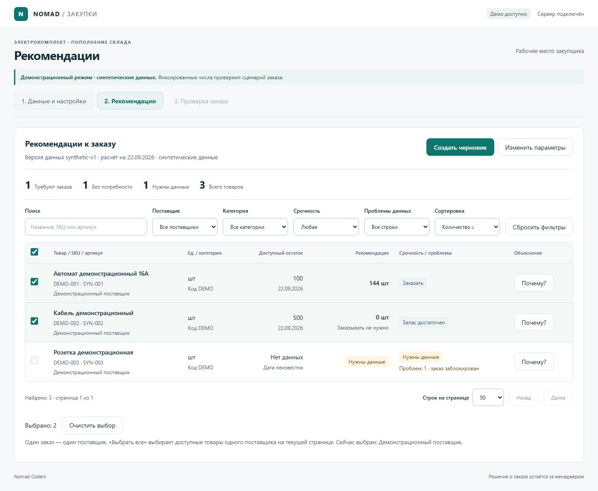

# Nomad Coders — помощник менеджера закупа

Веб-приложение команды **Nomad Coders** для HackAlem AI. Кейс Электрокомплекта: превратить историю продаж, остатки и ожидаемые поставки в объяснимый заказ поставщику.

**Рабочий путь:** загрузить Excel → рассчитать потребность → проверить объяснение → изменить черновик → согласовать → скачать CSV. Решение и ответственность за заказ остаются за менеджером; приложение ничего не отправляет поставщикам автоматически.



## Что реализовано

| Требование кейса | Работающее поведение |
| --- | --- |
| Базовый расчёт закупки | История, категория, доступный остаток, срок, пересмотр, буфер, датированные приходы, минимум и кратность |
| Сезонность и изменение спроса | Нормированный профиль 12 месяцев; устойчивый рост/снижение по полным месяцам |
| Скрытый спрос при отсутствии товара | Восстановление только по подтверждённым stockout-интервалам, без двойного учёта |
| Крупные разовые покупки | Анализ документов, исключение разового всплеска, сохранение повторяемых покупок; клиент учитывается при наличии ID |
| Заказ и объяснение | Поиск, фильтры, группировка выбором поставщика, график, исходные величины, причины, версии, согласование и CSV |

Импорт распознаёт известные XLSX Systeme Electric и IEK. Пропуски не превращаются в нули, коды и артикулы сохраняются строками, возвраты — со своим знаком. **0** означает отсутствие потребности по настройкам; **«Нет данных»** означает блокирующий недостаток входов.

## Запуск за несколько команд

Нужны **Python 3.12** и **Node.js 22.12+**. Проверено на Python 3.12.14 и Node 24.19.0. PowerShell, из корня репозитория:

```powershell
powershell -NoProfile -ExecutionPolicy Bypass -File scripts/setup.ps1 -SkipBrowser
powershell -NoProfile -ExecutionPolicy Bypass -File scripts/seed.ps1
powershell -NoProfile -ExecutionPolicy Bypass -File scripts/build.ps1
powershell -NoProfile -ExecutionPolicy Bypass -File scripts/serve.ps1 -Demo
```

Откройте **http://127.0.0.1:8000**. Терминал оставьте открытым; остановка — Ctrl+C. API: `/docs`, проверка сервера: `/api/health`. Адрес localhost работает только на вашем компьютере.

Setup создаёт `.venv` и устанавливает зафиксированные зависимости. Если Python launcher не находит 3.12, установите Python 3.12 либо передайте setup параметр `-Python` с путём к python.exe. Скрипты проверяют версии и могут найти совместимое окружение Codex. Папки окружений не входят в Git.

## Демонстрация за три минуты

1. Выберите **«Расчёт закупки · синтетические наблюдения»**. Дата — **22.09.2026**, срок 14 дней, пересмотр 7, запас 7, источник «Транзакции».
2. Нажмите **«Получить рекомендации»**. Ожидаются **144 шт**, отсутствие потребности и товар без остатка, который нельзя включить в заказ.
3. Откройте объяснение SYN-1: доступны числа, график, исключённый разовый документ, восстановленный спрос и приход.
4. Создайте черновик. Измените 144 на **0**, введите причину и сохраните. Обновите страницу: ноль и исходная рекомендация сохраняются.
5. Согласуйте и скачайте CSV. Новая правка снимает согласование. Для Excel: UTF-8, разделитель `;`.
6. Для сравнения вернитесь к настройкам: запас **14 дней** вместо 7 даёт **216 шт**. Это новый серверный расчёт.

Данные демонстрации полностью вымышлены. Второй набор **«Учебный склад»** — фиксированный пример интеграции; его настройки намеренно недоступны. Подробная проверка и ожидаемые результаты: [docs/TEST_DRIVE.md](docs/TEST_DRIVE.md).

## Настоящие данные и ограничения

В локальном интерфейсе выберите поставщика и загрузите его шесть XLSX. ZIP можно импортировать локальным скриптом, подставив собственный путь:

```powershell
powershell -NoProfile -ExecutionPolicy Bypass -File scripts/import.ps1 -Supplier systeme -Archive "$env:USERPROFILE\Downloads\Systeme electric.zip" -AsOf 2026-09-22
powershell -NoProfile -ExecutionPolicy Bypass -File scripts/import.ps1 -Supplier iek -Archive "$env:USERPROFILE\Downloads\IEK.zip" -AsOf 2026-09-22
```

Повторный импорт тех же файлов не создаёт дубль. Локально проверены оба архива: **724 товара Systeme и 3185 IEK**. Свободный остаток Systeme читается из AZ без повторного вычитания резерва; даты поставок — также из комментариев Excel. У IEK нет актуального снимка на 22 сентября: расчёт таких строк блокируется до уточнения остатка. Минимальная отгрузка IEK не считается кратностью.

Методика выбирает транзакции **или** полные месяцы и не складывает источники. Порог крупного документа: max(Q3 + 3 IQR, 5 медиан), при достаточной истории. Повторяемость проверяется отдельно. Сезонность нормируется к среднему 1; устойчивый рост оценивается по последним трём полным месяцам относительно предыдущих трёх. Потребность проверяется по дням: поздний приход не скрывает ранний дефицит. Затем применяются минимум и кратность.

Ограничения, которые важно понимать:

- Точность прогноза на отложенном периоде не измерена. Полнота журнала с начала 2025 года — явное допущение адаптера.
- В оригиналах нет customer_id и точных stockout-интервалов. Эти механизмы проверены на синтетике; реальные значения не придуманы. Поддерживаются дополнительные customer_id и книга с колонками sku/start/end.
- Ручной остаток, рост и буфер категории поддержаны API с явной причиной/настройкой; отдельных форм для всех этих полей в интерфейсе пока нет.
- Нет XLSX-экспорта, списка всех заказов, авторизации, живой интеграции 1С и автоматической отправки. Браузер восстанавливает последний расчёт и заказ.

Правила источников: [docs/DATA_NOTES.md](docs/DATA_NOTES.md). Оригиналы партнёра, базы и секреты исключены из Git.

## Разработка и проверки

Frontend и backend запускаются в двух терминалах:

```powershell
powershell -NoProfile -ExecutionPolicy Bypass -File scripts/dev.ps1 -Target backend -Demo
powershell -NoProfile -ExecutionPolicy Bypass -File scripts/dev.ps1 -Target frontend
```

Откройте http://127.0.0.1:5173. Vite проксирует `/api` на 8000. После production-сборки интерфейс обслуживает FastAPI по одному адресу.

```powershell
powershell -NoProfile -ExecutionPolicy Bypass -File scripts/setup.ps1
powershell -NoProfile -ExecutionPolicy Bypass -File scripts/check.ps1 -Browser
powershell -NoProfile -ExecutionPolicy Bypass -File scripts/contracts.ps1
git diff --exit-code -- contracts frontend/src/api/generated
```

Setup без `-SkipBrowser` устанавливает Chromium. Проверяются математика, импорт, ноль/null, отрицательные правки, версии, конкуренция, CSV, сборка, адаптивность и браузерный путь. **53 backend-проверки прошли с PostgreSQL**; без `NOMAD_TEST_DATABASE_URL` две проверки PostgreSQL пропускаются. Браузерные тесты обычного режима используют временную SQLite на 8009. Для внешнего публичного демо предназначен `frontend/tests/public-demo.spec.ts`, адрес задаётся `NOMAD_E2E_URL`.

Технологии: React, TypeScript, Vite, Tailwind CSS, Recharts; Python 3.12, FastAPI, Pydantic, openpyxl; SQLite локально, PostgreSQL в облаке. Версии — `frontend/package-lock.json` и `backend/requirements.lock`.

Модули: `ingestion` читает и нормализует XLSX; `engine` содержит чистые статистические функции; `service` связывает расчёт с хранением; `storage` сохраняет данные и версии; `export` формирует CSV. Pydantic — источник контракта; TypeScript генерируется из OpenAPI. Расчёту не нужен LLM или внешний API.

## Бесплатная публикация

Готовы `Dockerfile` и `render.yaml`: **Render Free + Neon Free**. Пошаговая настройка приватного репозитория и переменных: [docs/DEPLOYMENT.md](docs/DEPLOYMENT.md). Публичный адрес добавляется после создания и проверки сервиса; локальная сборка не означает завершённый деплой.

`DATABASE_URL` хранится только в секретах Render. `NOMAD_PUBLIC_DEMO=1` запрещает импорт оригиналов и показ несинтетических данных; демонстрационные заказы общие. PostgreSQL сохраняет версии после рестарта. Локальная SQLite по умолчанию — `runtime/nomad.sqlite3`, альтернативный путь — `NOMAD_DB`. Файл `.env` автоматически не читается.

Render Free может засыпать после простоя: перед защитой откройте сайт заранее. Стопроцентная доступность бесплатного хостинга не обещается; локальная версия остаётся резервом.

## Команда и сдача

Капитан отвечает за backend, данные, контракты, интеграцию и деплой. Тиммейт отвечает за frontend. Ветка капитана — `codex/api-integration`, frontend — `codex/web-ui`; объединение выполняет капитан. Перед началом работы: [AGENTS.md](AGENTS.md), [planning.md](planning.md), [docs/TEAM.md](docs/TEAM.md).

Push в GitHub и публикация сайта **не заменяют сдачу решения на платформе HackAlem**. Финальную ссылку и материалы отправляет команда по правилам организаторов.
