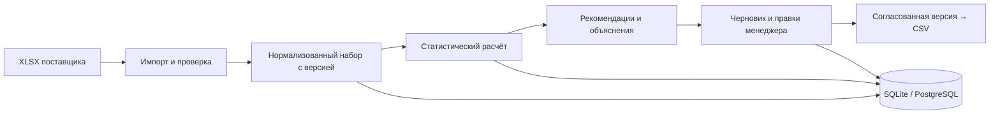

# Nomad Coders — объяснимое планирование закупок

**HackAlem AI · кейс Электрокомплекта · веб-приложение для менеджера закупа**

Nomad Coders помогает ответить на три практических вопроса: **что заказать, сколько заказать и почему именно столько**. Приложение объединяет историю продаж, остатки и ожидаемые поставки, рассчитывает потребность и проводит менеджера от рекомендации до согласованного заказа.

Каждое количество можно проверить по исходным величинам и правилам расчёта. Менеджер может изменить рекомендацию, указать причину и сохранить собственное решение. Исходные наблюдения и первоначальная рекомендация при этом не переписываются.

## Демонстрация для комиссии

### Открыть без установки

**[Открыть Nomad Coders →](https://surplus-tex-converter-balance.trycloudflare.com)**

Регистрация не требуется. В демонстрации используются только вымышленные данные; рекомендации основного учебного набора вычисляет настоящий статистический движок приложения.

> **Условия доступности.** Ссылка опубликована через Cloudflare Tunnel и работает, пока компьютер капитана, Docker и интернет включены. Это временная демонстрация для защиты. Постоянный Render-деплой подготовлен, но требует разрешения организации на доступ к приватному репозиторию. Если ссылка недоступна, приложение можно запустить локально по командам ниже.

### Проверить основной сценарий за 3–5 минут

Откройте **«1. Данные и настройки»**. Если браузер восстановил прежний заказ, просто перейдите на этот экран.

| Шаг | Действие | Ожидаемый результат |
| --- | --- | --- |
| 1 | Выберите **«Расчёт закупки · синтетические наблюдения»** | Видна пометка синтетических данных; настройки доступны для изменения |
| 2 | Установите дату **22.09.2026**, срок **14**, пересмотр **7**, страховой запас **7**, источник **«Транзакции»**. Нажмите **«Получить рекомендации»** | SYN-1 — **144 шт**; SYN-2 — **0 шт / «Заказывать не нужно»**; SYN-3 — **«Нужны данные»**, выбор в заказ отключён |
| 3 | Откройте объяснение SYN-1 | Видны спрос, остаток, приход, потребность до округления, кратность, график, решения по аномалиям и допущения |
| 4 | Проверьте поиск по SKU, фильтр срочности и сброс фильтров | Таблица меняется; нулевая потребность и неизвестное количество остаются разными состояниями |
| 5 | Нажмите **«Создать черновик»**, измените SYN-1 с **144 на 0**, укажите причину и нажмите **«Сохранить правки»** | Новая версия черновика содержит 0; исходная рекомендация остаётся 144 |
| 6 | Обновите страницу | Заказ и сохранённая правка восстанавливаются |
| 7 | Нажмите **«Согласовать заказ»**, затем **«Скачать CSV»** | Браузер скачивает CSV согласованной версии с нулевым количеством и причиной правки |
| 8 | Измените согласованный заказ на **12** и сохраните | Заказ снова становится черновиком; для следующего экспорта требуется новое согласование |
| 9 | Вернитесь к данным, увеличьте страховой запас с **7 до 14** и выполните новый расчёт | Рекомендация SYN-1 увеличивается до **216 шт**; прежний расчёт и заказ не переписываются |

В базовом примере спрос равен 10 шт/день. Горизонт — 21 день, страховой запас — ещё 7 дней, остаток — 100, подходящий приход — 40. Потребность: **210 + 70 − 100 − 40 = 140 шт**; округление по кратности 12 даёт **144 шт**. В истории отдельно присутствуют разовая покупка 10 000 шт и шесть подтверждённых дней отсутствия товара: объяснение показывает исключение выброса и восстановление 60 шт исторического спроса. Восстановленные продажи не прибавляются повторно к заказу как задолженность.

CSV обычно попадает в папку **«Загрузки»**. Название — `order-<идентификатор>-v<версия>.csv`. Файл содержит UTF-8 BOM и разделитель `;`; при необходимости выберите эти параметры при импорте в Excel. **«Сохранить правки»** сохраняет заказ в базе, а **«Скачать CSV»** создаёт файл на компьютере проверяющего.

Второй набор, **«Учебный склад · синтетика»**, — фиксированный пример проверки соединения компонентов. Его настройки заблокированы намеренно. Для проверки пересчёта используйте первый набор.


## Задача и границы решения

В предоставленных данных продажи, остатки, сезонность и ограничения заказа находятся в разных книгах Excel. Они описывают разные периоды и не всегда содержат все необходимые сведения. Простое суммирование отчётов или подстановка нулей вместо пропусков может дать необоснованное количество к закупке.

Мы разделили решение на три этапа: **проверка и нормализация данных → воспроизводимый расчёт → решение менеджера**. Приложение показывает проблемы входных данных и блокирует строки, для которых количество нельзя обосновать. Это инструмент поддержки закупки; окончательное решение остаётся за человеком.

### Покрытие пяти требований кейса

| Требование | Реализация | Как проверить |
| --- | --- | --- |
| Базовый заказ по данным поставщика | История спроса, доступный остаток, срок поставки, интервал пересмотра, буфер, категория, датированные приходы, минимум и кратность | Расчёт SYN-1 и числовое объяснение; локальный импорт известных XLSX |
| Сезонность и устойчивый рост | Профиль 12 месяцев нормируется к среднему 1; рост/снижение оценивается по очищенной истории полных месяцев | Компоненты и допущения ответа; автоматические тесты сезонности и устойчивого роста |
| Скрытый спрос при отсутствии товара | Восстановление только по подтверждённым интервалам stockout; пересекающиеся интервалы не учитываются дважды | Восстановленные 60 шт в учебном SYN-1; тесты пересечений и противоречий |
| Разовые крупные покупки | Анализ объёма документа, исключение одиночного всплеска, сохранение повторяемых покупок; ID клиента учитывается при наличии | Раздел «Крупные покупки и аномалии», документ 10 000 шт; тесты регулярных крупных покупок |
| Объяснимый заказ поставщику | Фильтры по поставщику, один поставщик на черновик, причины расчёта, правки, версии, согласование и CSV | Полный сценарий выше, включая сохранение нуля и повторное согласование |

**0 и отсутствие значения принципиально различаются.** Ноль означает, что по выбранным входам и настройкам новый заказ не требуется. `null` отображается как нехватка данных; такую строку нельзя включить в заказ.

## Локальный запуск с нуля

### 1. Подготовить инструменты

Нужны **Git**, **Python 3.12** и **Node.js 22.12 или новее**. Рабочее окружение команды: Python **3.12.14**, Node.js **24.19.0**, npm **10.9.0**. Для воспроизведения удобно использовать Node 24. Docker, аккаунты облачных сервисов и ключи внешних API для обычного локального запуска не нужны.

После установки инструментов откройте **новое окно PowerShell** и проверьте:

```powershell
git --version
py -3.12 --version
node --version
npm.cmd --version
```

Если `git` не найден — установите Git и заново откройте терминал. Если `py -3.12` сообщает `No suitable Python runtime found`, установите именно Python 3.12. Setup также допускает явный путь: `-Python 'C:\путь\к\python.exe'`.

### 2. Получить репозиторий

Репозиторий приватный: для клонирования нужен доступ GitHub, предоставленный организаторами. Проверка по публичной демонстрационной ссылке доступа к репозиторию не требует.

Команды ниже предназначены для **новой папки**, которой ещё нет:

```powershell
cd "$env:USERPROFILE\Documents"
git clone https://github.com/BAITC-Hacks/hack-43bfd950-nomad-coders.git nomad-coders-review
cd nomad-coders-review
git switch main
```

### 3. Установить зависимости и подготовить демонстрацию

Все дальнейшие команды выполняются **из корня репозитория**:

```powershell
powershell -NoProfile -ExecutionPolicy Bypass -File scripts/setup.ps1 -SkipBrowser
powershell -NoProfile -ExecutionPolicy Bypass -File scripts/seed.ps1
powershell -NoProfile -ExecutionPolicy Bypass -File scripts/build.ps1
powershell -NoProfile -ExecutionPolicy Bypass -File scripts/serve.ps1 -Demo
```

`setup` создаёт отдельное Python-окружение `.venv`, устанавливает зависимости из lock-файлов и проверяет совместимость версий. `seed` добавляет два явно синтетических набора; повторный запуск не создаёт дублей и не удаляет заказы. `build` собирает интерфейс, `serve` запускает API и собранный сайт.

### 4. Открыть приложение

- **Приложение:** http://127.0.0.1:8000
- **Документация API:** http://127.0.0.1:8000/docs
- **Проверка сервера:** http://127.0.0.1:8000/api/health

Оставьте терминал сервера открытым. Остановка — **Ctrl+C**. Заказы сохраняются в `runtime/nomad.sqlite3` и переживают перезапуск. Адрес `127.0.0.1` доступен только на компьютере, где запущен сервер.

### Альтернатива: запуск через Docker

Если установлен и запущен Docker с Linux-контейнерами, Python и Node на компьютере не требуются. Из корня клонированного репозитория:

```powershell
docker build -t nomad-coders:demo .
docker run -d --name nomad-review -p 127.0.0.1:8080:8000 -e NOMAD_DEMO=1 --mount type=volume,source=nomad-review-data,target=/app/runtime nomad-coders:demo
```

Откройте http://127.0.0.1:8080. В этом локальном варианте SQLite сохраняется в Docker volume `nomad-review-data`. Команда `docker run` нужна только при первом создании контейнера; далее:

```powershell
docker logs nomad-review
docker stop nomad-review
docker start nomad-review
```

## Загрузка настоящих данных

**Оригиналы партнёра не включены в репозиторий и публичную демонстрацию.** Для проверки реальных входов нужны предоставленные организаторами файлы и локальный запуск.

В разделе «Загрузка Excel» выберите Systeme Electric или IEK и загрузите комплект из шести XLSX этого поставщика. Адаптеры рассчитаны на известные структуры исходных книг, а не на произвольную таблицу. Максимальный общий размер HTTP-загрузки — 30 МиБ. Набор получает версию и сведения об источниках; повторная загрузка одинакового содержимого возвращает существующий набор.

ZIP-архив можно импортировать локальной командой. Замените путь своим; архив распаковывать в репозиторий не нужно:

```powershell
powershell -NoProfile -ExecutionPolicy Bypass -File scripts/import.ps1 -Supplier systeme -Archive "$env:USERPROFILE\Downloads\Systeme electric.zip" -AsOf 2026-09-22
powershell -NoProfile -ExecutionPolicy Bypass -File scripts/import.ps1 -Supplier iek -Archive "$env:USERPROFILE\Downloads\IEK.zip" -AsOf 2026-09-22
```

Оба исходных архива проверены локально: **724 товара и 77 312 транзакций Systeme; 3 185 товаров и 171 603 транзакции IEK**. Эти числа описывают прочитанные записи, включая проблемные, а не количество безусловно готовых заказов.

При работе с источниками мы сохраняем следующие различия:

- Строковые SKU и артикулы сохраняют ведущие нули. Пропуск не становится нулём, отрицательная операция не становится положительной продажей.
- Месячные продажи и транзакции одного периода не суммируются. Расхождения отражаются в предупреждениях.
- У Systeme используется свободный остаток AZ; резерв не вычитается второй раз. Даты входящих поставок читаются в том числе из комментариев Excel.
- У IEK месячный остаток не является подтверждённым текущим снимком на 22 сентября. Такие рекомендации блокируются до уточнения остатка.
- Минимальная отгрузка и кратность упаковки — независимые ограничения. Неопределённое преобразование упаковок в метры не выполняется автоматически.

Подробное описание входов и ограничений: [docs/DATA_NOTES.md](docs/DATA_NOTES.md).

## Как рассчитывается рекомендация

Движок `statistical-v1` выполняет воспроизводимый расчёт без обязательных вызовов LLM. При одинаковых нормализованных данных и настройках он возвращает одинаковые рекомендации; идентификаторы и время сохранения нового расчёта назначаются отдельно.

1. **Выбор истории.** Используются транзакции либо полные месячные наблюдения. Неполные месяцы не выдаются за полные; неизвестные значения не включаются как нулевые продажи.
2. **Очистка крупных покупок.** Строки агрегируются в документы. При достаточной истории порог кандидата в выброс — `max(Q3 + 3 × IQR, 5 × медиана)`, где IQR — разность 75-го и 25-го процентилей. Повторяемость проверяется отдельно: регулярные крупные покупки не исключаются только из-за объёма. Решение и причина сохраняются.
3. **Сезонность и stockout.** Сезонность снимается с истории и один раз применяется к прогнозным дням. Подтверждённые дни отсутствия товара исключаются из времени доступности при оценке спроса; потерянный исторический спрос восстанавливается для объяснения. Нулевого месячного остатка недостаточно, чтобы объявить весь месяц stockout.
4. **Устойчивое изменение спроса.** При наличии шести последовательных полных месяцев сравниваются последние три с предыдущими тремя. Автоматический коэффициент ограничивается диапазоном 0,5–2 с предупреждением при ограничении. При недостаточной истории рост не придумывается.
5. **Потребность по дням.** Горизонт равен сроку поставки плюс интервал пересмотра. Для каждого дня учитываются прогноз, буфер, доступный остаток и только поступившие к этому дню поставки. Берётся максимальная положительная потребность: поздний приход не может покрыть дефицит предыдущего дня. Дефицит до обычного срока поставки помечается как срочный.
6. **Ограничения заказа.** При положительной потребности применяются минимальная отгрузка и округление вверх по подтверждённой кратности. Ноль остаётся нулём. При блокирующих проблемах возвращается неизвестное количество с объяснением.

Через API дополнительно доступны буфер по категории, явный текущий остаток и ручной коэффициент роста с причиной. Отдельные формы для всех этих переопределений пока не реализованы в интерфейсе.

## Почему выбран этот стек

В условиях пятичасовой разработки мы выбрали один backend, один frontend и общий контракт данных. Это позволило разрабатывать интерфейс и расчёты параллельно, а после сборки обслуживать приложение по одному адресу.

| Технология | Роль и основание выбора |
| --- | --- |
| **React + TypeScript** | Формы, таблицы, фильтры и состояния заказа; типизация помогает согласовать интерфейс с API |
| **Vite + Tailwind CSS** | Быстрый цикл разработки и единое сдержанное оформление; Tailwind подключён официальным Vite-плагином |
| **Recharts** | Исходная, очищенная, восстановленная история и прогноз; график загружается отдельно от основного интерфейса |
| **Python 3.12 + FastAPI + Uvicorn** | HTTP API и интеграция импорта, расчёта и хранения в одном приложении |
| **Pydantic + OpenAPI** | Валидация данных и единый источник схем; TypeScript-типы генерируются автоматически |
| **openpyxl** | Чтение известных XLSX, включая комментарии с датами поставок |
| **SQLite / PostgreSQL** | SQLite даёт простой локальный запуск; PostgreSQL поддерживает хранение в отдельном сервисе и транзакционные версии заказов |
| **pytest + HTTPX + Playwright** | Проверка математики, HTTP-поведения, сохранения и настоящего браузерного сценария до скачивания CSV |
| **Docker** | Воспроизводимая Linux-сборка frontend и backend с зафиксированными зависимостями |

`pandas` и `NumPy` включены в подготовленное Python-окружение; текущая логика движка написана преимущественно на стандартной библиотеке, импорт — на openpyxl. Мы не заявляем их использование там, где расчёт обходится без них.

Статистический подход выбран ради проверяемых чисел, повторяемости и независимости от внешних ключей, задержек и генерации текста. Кодекс использовался как инструмент разработки и проверки, но не является сервисной зависимостью приложения.

## Архитектура и контракт API



Расчёт не читает файлы, базу или сеть: он получает нормализованный набор и настройки. HTTP, хранение, импорт и экспорт отделены от математических функций.

```text
backend/app/
  contracts/      Pydantic-модели
  ingestion/      Распознавание и нормализация XLSX
  engine/         Спрос, аномалии, сезонность и потребность
  storage/        SQLite и PostgreSQL
  export/         CSV и экранирование текстовых формул
  service.py      Связь компонентов и правила версий заказа
  main.py         HTTP API и собранный frontend
frontend/src/
  pages/          Данные, рекомендации, заказ
  components/     Объяснение, график и общие элементы
  api/            Единый клиент и сгенерированные типы
contracts/        OpenAPI и синтетические JSON-примеры
scripts/          PowerShell-команды установки и проверки
docs/             Методика источников, проверка и деплой
```

| Маршрут | Назначение |
| --- | --- |
| `GET /api/health` | Состояние сервера и режим демонстрации |
| `GET /api/datasets`, `POST /api/datasets` | Список и загрузка наборов |
| `POST /api/calculations`, `GET /api/calculations/{id}` | Новый расчёт и чтение сохранённого результата |
| `GET /api/calculations/{id}/items/{item_id}` | Объяснение отдельного товара |
| `POST /api/orders`, `GET /api/orders/{id}`, `PATCH /api/orders/{id}` | Создание, чтение и правки заказа |
| `POST /api/orders/{id}/approve` | Согласование конкретной версии |
| `GET /api/orders/{id}/export?revision=3&format=csv` | Экспорт текущей согласованной версии |

Правка передаёт ожидаемую `revision`, создаёт новую версию и снимает согласование. Согласование также увеличивает версию. Конкурирующая устаревшая правка возвращает **409**, не перезаписывая чужое решение. **404** означает отсутствующий ресурс, **422** — неверные входы, **403** — запрет импорта в публичном демо. Изменение настроек фиксированного примера возвращает явную **501**. Ошибки имеют общий формат `error.code`, `error.message`, `error.details`.

CSV формируется на сервере из согласованной версии. Текстовые поля экранируются от интерпретации как формул Excel. Автоматической отправки поставщику нет.

## Проверки и воспроизводимость

Фактически выполнены:

| Проверка | Результат |
| --- | --- |
| Backend с настоящей локальной PostgreSQL | **53 passed** |
| Backend без тестового PostgreSQL-подключения | **51 passed, 2 skipped** |
| Объединённый frontend: локальные браузерные сценарии | **13 passed** |
| Публичный HTTPS: пересчёт, сохранение, согласование и CSV | **1 passed** |
| TypeScript, production-сборка и Linux Docker-образ | Успешно |
| Сохранение заказа после рестарта контейнера | Подтверждено |

Математические проверки покрывают поздние приходы, минимум и кратность, ноль и пропуск, знаки возвратов, единицы, разовые и регулярные покупки, рост, сезонность и stockout. Браузерные сценарии проверяют также конфликты версий, ошибки сети, таблицу из 1001 товара и размеры экрана от телефона до ноутбука. Успешная сборка не используется вместо проверки поведения.

Для повторения обычных проверок, из корня:

```powershell
# Установить зависимости и браузер Chromium для Playwright
powershell -NoProfile -ExecutionPolicy Bypass -File scripts/setup.ps1

# Backend, TypeScript, сборка и 13 локальных браузерных сценариев
powershell -NoProfile -ExecutionPolicy Bypass -File scripts/check.ps1 -Browser

# Перегенерировать контракт и убедиться в отсутствии расхождений
powershell -NoProfile -ExecutionPolicy Bypass -File scripts/contracts.ps1
git diff --exit-code -- contracts frontend/src/api/generated
```

Порт **8009** должен быть свободен: локальные браузерные проверки создают отдельный временный сервер и SQLite. Две проверки PostgreSQL требуют `NOMAD_TEST_DATABASE_URL` с адресом отдельной тестовой базы; они создают и удаляют только собственные случайные схемы. GitHub Actions настроен на проверки Windows и PostgreSQL под Linux; локальные результаты не означают автоматически успешный удалённый запуск CI.

Повторить именно проверку публичной страницы:

```powershell
$env:NOMAD_E2E_URL = 'https://surplus-tex-converter-balance.trycloudflare.com'
powershell -NoProfile -ExecutionPolicy Bypass -File scripts/check.ps1 -Browser
Remove-Item Env:NOMAD_E2E_URL
```

При заданном адресе вместо 13 локальных сценариев выполняется один сценарий публичного демо. Он создаёт явно синтетический проверочный заказ. Отдельная HTTP-проверка без браузера:

```powershell
.venv/Scripts/python.exe backend/scripts/smoke.py https://surplus-tex-converter-balance.trycloudflare.com --state runtime/public-smoke.json
```

## Режим разработки и настройки

После `setup` и `seed` откройте два терминала в корне проекта.

**Терминал 1 — API:**

```powershell
powershell -NoProfile -ExecutionPolicy Bypass -File scripts/dev.ps1 -Target backend -Demo
```

**Терминал 2 — frontend:**

```powershell
powershell -NoProfile -ExecutionPolicy Bypass -File scripts/dev.ps1 -Target frontend
```

Откройте http://127.0.0.1:5173. Vite направляет `/api` к FastAPI на 8000. Для проверки production-варианта остановите dev-backend, выполните `scripts/build.ps1`, затем `scripts/serve.ps1 -Demo`.

| Переменная | Назначение |
| --- | --- |
| `NOMAD_DB` | Путь SQLite; по умолчанию `runtime/nomad.sqlite3` |
| `DATABASE_URL` | Подключение PostgreSQL; при наличии используется вместо SQLite |
| `NOMAD_DEMO=1` | Разрешить доступ к синтетическим наборам |
| `NOMAD_PUBLIC_DEMO=1` | Только синтетика; импорт и чтение настоящих данных закрыты. Требует PostgreSQL и включённого демо |
| `PORT` | Порт контейнера; по умолчанию 8000 |

Приложение читает переменные окружения процесса. `.env` автоматически не загружается. Строки подключения не должны попадать в Git, frontend или публичные логи. Python-зависимости закреплены в `backend/requirements.lock`, frontend — в `frontend/package-lock.json`.

## Ограничения и дальнейшее развитие

Результат хакатона — работающий прототип с объяснимым расчётом и проверенным сценарием заказа. Его ограничения обозначены явно:

- **Нет оценки точности на отложенном периоде.** Полнота журнала с начала 2025 года — допущение известного адаптера, отражённое в предупреждениях. Следующий шаг — временное тестирование прогноза и сравнение с базовыми методами.
- **В оригиналах нет точных stockout-интервалов и ID клиентов.** Соответствующая логика проверена на синтетике; отсутствующие реальные сведения не выдумываются. Поддержаны дополнительные `customer_id` и книга с колонками `sku/start/end`.
- **Качество входов ограничивает расчёт.** Устаревший остаток, неизвестные единицы и противоречия могут заблокировать строку. Загрузка файла не равна подтверждению его полноты и корректности.
- **Не все настройки выведены в UI.** Ручной остаток, рост и буферы категорий доступны через контракт API; их формы — следующий этап.
- **Публичное демо не является личным кабинетом.** Нет авторизации и разделения пользователей; демонстрационные заказы общие. Импорт реальных данных доступен локально.
- **Экспорт — CSV.** XLSX-экспорт, список всех сохранённых заказов, подтверждённый формат импорта 1С и автоматическая отправка поставщикам не реализованы. Браузер восстанавливает последний расчёт и заказ.

## Публикация и работа команды

Текущая демонстрация: **Cloudflare Tunnel → Docker-приложение → локальная PostgreSQL**. Оригиналы партнёра не публикуются; внешняя ссылка открывает только синтетический режим. Заказы переживают рестарт приложения, но доступность сайта зависит от компьютера капитана.

Для размещения независимо от ноутбука подготовлены `Dockerfile` и `render.yaml` для **Render Free + Neon Free**. Neon пока не подключён к работающему демо. Render ожидает разрешения организации на приватный репозиторий. Подробности, команды и ограничения: [docs/DEPLOYMENT.md](docs/DEPLOYMENT.md).

Разработка велась в Codex desktop с разделением ответственности: капитан — backend, данные, контракты и интеграция; тиммейт — frontend в отдельной рабочей папке и ветке. Общие схемы изменяет интегратор; TypeScript-типы генерируются из Pydantic. Изменения объединялись в `main` после проверок. Независимые проверки кода использовались для поиска ошибок в расчётах и сохранении заказов.

| Документ | Для чего читать |
| --- | --- |
| [Проверка сайта](docs/TEST_DRIVE.md) | Расширенный сценарий приёмки и ожидаемые результаты |
| [Контракт](contracts/README.md) | Схемы, значения полей и правила версий |
| [Источники данных](docs/DATA_NOTES.md) | Наблюдения по исходным книгам и ограничения |
| [План backend](docs/BACKEND_PLAN.md) | Реализация и результаты проверок импорта и расчёта |
| [Роли команды](docs/TEAM.md) | Ответственность и порядок интеграции |
| [Общий план](planning.md) | Ход реализации и принятые решения |

**Публикация кода и демонстрационной ссылки не заменяет сдачу решения на платформе HackAlem.** Команда отдельно передаёт материалы по правилам организаторов.
